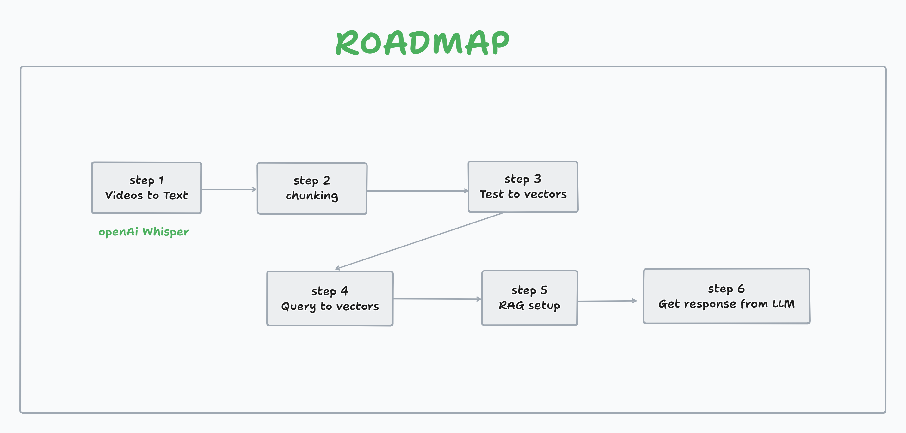

# RAG-Based AI Teaching Assistant (Data Science Edition)

This repository documents the development of a Retrieval-Augmented Generation (RAG) based Teaching Assistant designed for Data Science learners. The objective of this project is to create an assistant capable of answering course-related questions by retrieving and interpreting relevant information from actual lecture content.  

The workflow mimics how a real teaching assistant learns: it first understands the lecture material and then uses that knowledge to respond accurately and contextually.

---

### Project Roadmap Overview

Below is a visual representation of the overall pipeline for building this AI Teaching Assistant.

*(Replace `Project-Roadmap.png` path as needed)*

<p align="center">
  
</p>

---

# How to use this RAG AI Teaching Assistant on your own data

## Step 1 — Collect your videos
Move all your video files to the `videos` folder.

## Step 2 — Convert to mp3
Convert all the video files to mp3 by running `video_to_mp3`.

## Step 3 — Convert mp3 to json
Convert all the mp3 files to json by running `mp3_to_json`.

## Step 4 — Convert the json files to Vectors
Use the file `preprocess_json` to convert the json files to a dataframe with Embeddings and save it as a joblib pickle.

## Step 5 — Prompt generation and feeding to LLM
Read the joblib file and load it into the memory. Then create a relevant prompt as per the user query and feed it to the LLM.


---

## Phase 1: Converting Raw Lecture Videos into Usable Text

The project begins with collecting lecture material in `.mp4` video format. Because language models cannot directly process video, the content must be converted to a text-readable form. This phase focuses on transforming video data into structured textual knowledge.

### Processing Workflow

| Stage | Task | Tool/Method |
|-------|------|-------------|
| 1 | Convert `.mp4` videos to `.mp3` audio | `ffmpeg -i input.mp4 output.mp3` |
| 2 | Generate text transcripts from audio | Whisper (speech-to-text) |
| 3 | Clean, structure and store transcripts | Python preprocessing |

### Why Audio Conversion?

Transcribing audio is significantly more efficient than transcribing video. Extracting audio first reduces processing cost and improves transcription performance, especially when working with cloud or local resources.

---

## About Transcription in Phase 2

Although Whisper was chosen for transcription, local hardware limitations prevented smooth execution of the speech-to-text model on the primary development machine.  
Therefore:

- The transcription stage was moved to a dedicated branch.
- Google Colab GPUs were used to run Whisper efficiently.
- The transcripts were exported in structured `.json` format, including timestamps and text segments.
- Only the structured transcripts were brought back for further RAG processing in later phases.

These outputs serve as the textual knowledge base for the Teaching Assistant.

---

## Phase 3: Creating Vector Embeddings for Efficient Retrieval

After obtaining structured transcripts, the next step is to convert the text into a searchable numerical representation. In this phase, each transcript is split into meaningful chunks, and every chunk is converted into a dense vector using the **BGE-M3 model via Ollama**. This enables efficient semantic similarity lookup when answering questions.

Since repeatedly generating embeddings is slow and computationally expensive, all computed vectors are stored locally using a `.joblib` file. This ensures fast loading and avoids re-running the embedding model every time a query is processed.

### Phase 3 Workflow Summary

| Step | Task | Method/Tool |
|------|------|-------------|
| 1 | Split transcript into context-preserving text chunks | Custom Python chunking |
| 2 | Convert chunks into dense embeddings | Ollama + BGE-M3 |
| 3 | Store computed embeddings for reuse | `.joblib` serialization |
| 4 | Prepare for similarity search | Cosine comparison |

The resulting embedding database forms the core “knowledge representation” of the AI assistant, enabling semantic retrieval of relevant content.

---

### Note on the Upcoming Phase

In the next phase, user queries will be converted into embeddings and compared with the stored vectors using cosine similarity. The most relevant text chunks will then be supplied to a language model to generate accurate, context-aware responses.  
Documentation for Phase-4 will be added when implementation is completed.We will make updates regarding make the project more efficient via integrating APIs. Thanks for reading!

---


## Project Files (Current Status)

```bash
RAG_Based_AI_Teaching_Assistant/
│
├── src/                # Core scripts (to be expanded in later phases)
├── test_data/          # Raw sample videos (ignored in .gitignore)
├── audio_data/         # Extracted audio (ignored in .gitignore)
├── transcripts/        # Cleaned or structured text outputs
└── README.md           # Main documentation (this file)
